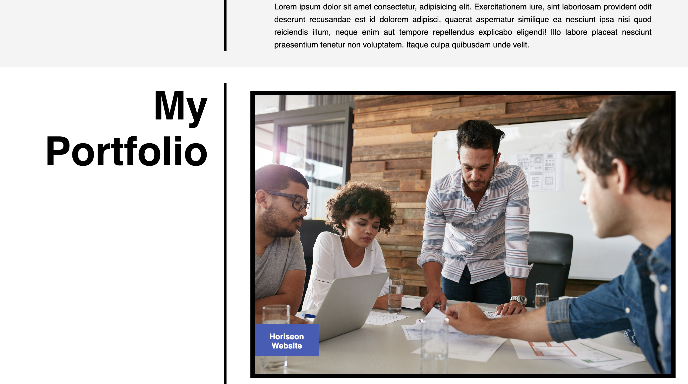

# Jarrod's Portfolio Website

## Description

In this assignment we were task to create a portfolio website to showcase our work. I used what we learned in class last week such as flexbox and css grid.  Also refactored code for responsive design.

## Repository

Link to deployed code:  https://jarrodkrauszer.github.io/jarrods_portfolio/

## Technologies

 - This is written with HTML5 and CSS 
 - Used flexbox and grid to layout some of the sections
 - Refactored HTML and CSS for responsive design
 - Also used media queries to change the layout at different sizes
 - Used CSS variables for some of the repeated colors

## Mock-Up

The following image shows the web application's appearance and functionality:

